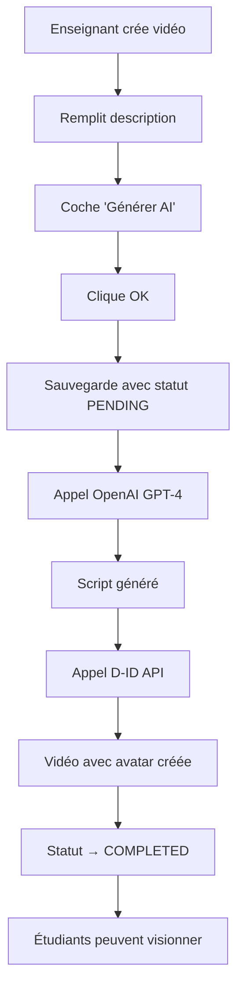

# 🎬 Guide : Génération de Vidéos AI avec Avatar Parlant

## 🚀 Vue d'ensemble

Cette fonctionnalité permet aux **enseignants** de générer automatiquement des vidéos éducatives avec un **avatar réel qui parle** à partir d'une simple description textuelle.

### Technologies utilisées :
- **OpenAI GPT-4** : Génération du script pédagogique
- **D-ID API** : Création de vidéo avec avatar parlant
- **JavaFX** : Interface utilisateur

---

## ⚙️ Configuration Requise

### 1. Clés API nécessaires

Vous devez obtenir deux clés API :

#### 🔑 OpenAI API Key
1. Allez sur https://platform.openai.com/api-keys
2. Créez un nouveau projet ou utilisez un existant
3. Générez une nouvelle clé API
4. **Coût estimé** : ~$0.02 par vidéo générée

#### 🔑 D-ID API Key  
1. Allez sur https://www.d-id.com/
2. Créez un compte (essai gratuit disponible)
3. Obtenez votre clé API dans le dashboard
4. **Coût estimé** : ~$0.05-0.20 par vidéo générée

### 2. Configuration du fichier

Éditez le fichier `src/main/resources/ai-config.properties` :

```properties
# Remplacez par vos vraies clés API
openai.api.key=sk-proj-VOTRE_VRAIE_CLE_OPENAI_ICI
did.api.key=VOTRE_VRAIE_CLE_DID_ICI

# Configuration de l'avatar (optionnel)
did.avatar.url=https://create-images-results.d-id.com/DefaultPresenters/Noelle_f/image.jpeg
did.voice.id=en-US-JennyNeural
```

⚠️ **IMPORTANT** : Ne jamais commiter ce fichier avec de vraies clés API !

---

## 👨‍🏫 Guide Enseignant : Créer une Vidéo AI

### Étape 1 : Accéder à la création de vidéo

1. Connectez-vous en tant qu'**enseignant** ou **admin**
2. Allez dans **"Gestion des cours"** (menu back-office)
3. Dans l'onglet **"Chapitres"**, double-cliquez sur un chapitre
4. Choisissez **"Créer vidéo"**

### Étape 2 : Remplir le formulaire

1. **Titre** : Donnez un titre clair à votre vidéo
2. **Description** : Écrivez une description détaillée (minimum 50 caractères)
   - Plus la description est détaillée, meilleure sera la vidéo
   - Exemple : *"Expliquer le concept de boucles en programmation avec des exemples concrets. Montrer la différence entre for et while. Donner des cas d'usage pratiques."*
3. **✅ Cochez "🤖 Générer vidéo AI depuis la description"**
4. Le champ URL se désactive automatiquement
5. Cliquez **"OK"**

### Étape 3 : Génération en cours

1. Un message confirme le lancement : **"🤖 Génération AI lancée"**
2. La vidéo apparaît avec le statut **"🤖 En attente"**
3. Le processus prend **2-5 minutes** selon la longueur

### Étape 4 : Vidéo prête

1. Le statut passe à **"🤖 AI Générée"**
2. Les étudiants peuvent maintenant visionner la vidéo
3. Un message de confirmation s'affiche

---

## 👨‍🎓 Guide Étudiant : Visionner une Vidéo AI

### Dans la page de détail du cours :

1. Ouvrez un cours depuis **"Mes cours"**
2. Développez un chapitre
3. Les vidéos AI sont marquées **"🤖 AI Générée"**
4. Cliquez sur **"▶ Regarder"** pour visionner

### Caractéristiques des vidéos AI :

- **Avatar réaliste** qui parle avec une voix naturelle
- **Script pédagogique** adapté au niveau du cours
- **Durée** : 2-3 minutes en moyenne
- **Qualité** : HD avec synchronisation labiale parfaite

---

## 🔧 Statuts de Génération

| Statut | Icône | Description |
|--------|-------|-------------|
| **En attente** | 🤖 ⏳ | Génération pas encore commencée |
| **Génération...** | 🤖 ⚙️ | Script et vidéo en cours de création |
| **AI Générée** | 🤖 ✅ | Vidéo prête, visible par les étudiants |
| **Erreur AI** | ❌ | Échec de génération (vérifier les clés API) |

---

## 🎯 Conseils pour de Meilleures Vidéos

### ✅ Bonnes pratiques pour la description :

```
✅ BON EXEMPLE :
"Expliquer les algorithmes de tri en informatique. Commencer par le tri à bulles avec un exemple visuel d'un tableau de nombres. Montrer étape par étape comment les éléments se déplacent. Puis présenter le tri rapide et expliquer pourquoi il est plus efficace. Terminer par des cas d'usage concrets dans le développement web."

❌ MAUVAIS EXEMPLE :
"Les algorithmes de tri"
```

### 📝 Structure recommandée :

1. **Objectif** : "Expliquer [concept]"
2. **Approche** : "Commencer par..., puis..."
3. **Exemples** : "Avec des exemples de..."
4. **Applications** : "Cas d'usage dans..."

### 🎬 Optimisation du contenu :

- **Longueur idéale** : 100-300 mots de description
- **Vocabulaire** : Adapté au niveau (éviter le jargon pour débutants)
- **Structure** : Introduction → Explication → Exemples → Conclusion
- **Engagement** : Poser des questions, utiliser des analogies

---

## 🛠️ Dépannage

### Problème : "Clé API OpenAI non configurée"
**Solution** : Vérifiez le fichier `ai-config.properties` et remplacez `VOTRE_NOUVELLE_CLE_OPENAI_ICI` par votre vraie clé.

### Problème : "Clé API D-ID non configurée"  
**Solution** : Ajoutez votre clé D-ID dans le fichier de configuration.

### Problème : "Erreur génération du script"
**Solutions** :
- Vérifiez votre crédit OpenAI sur https://platform.openai.com/usage
- Assurez-vous que la description fait au moins 50 caractères
- Vérifiez votre connexion internet

### Problème : "Erreur génération de la vidéo"
**Solutions** :
- Vérifiez votre crédit D-ID sur votre dashboard
- Le script généré peut être trop long (max 1000 caractères)
- Réessayez dans quelques minutes (limite de taux API)

### Problème : Vidéo bloquée sur "En attente"
**Solutions** :
- Attendez 5-10 minutes (génération peut être lente)
- Vérifiez les logs de l'application
- Redémarrez l'application si nécessaire

---

## 💰 Coûts Estimés

### OpenAI GPT-4 :
- **~$0.01-0.03** par script généré
- Dépend de la longueur de la description

### D-ID :
- **Plan Lite** : $5.99/mois pour 20 vidéos
- **Plan Pro** : $29.99/mois pour 100 vidéos
- **Pay-per-use** : ~$0.20 par vidéo

### Total par vidéo : **~$0.21-0.23**

---

## 🔒 Sécurité et Confidentialité

### Protection des clés API :
- ✅ Stockées dans un fichier de configuration local
- ✅ Non commitées dans le code source
- ✅ Chargées dynamiquement au runtime

### Données utilisateur :
- ✅ Descriptions de cours restent privées
- ✅ Scripts générés stockés localement
- ✅ Aucune donnée personnelle envoyée aux APIs

### Recommandations :
- 🔄 Régénérez vos clés API périodiquement
- 📊 Surveillez votre usage sur les dashboards
- 🚫 Ne partagez jamais vos clés API

---

## 🚀 Fonctionnalités Avancées

### Personnalisation de l'avatar :
Modifiez `did.avatar.url` dans la configuration pour utiliser un autre avatar D-ID.

### Choix de la voix :
Changez `did.voice.id` pour une voix différente :
- `en-US-JennyNeural` (femme, anglais US)
- `fr-FR-DeniseNeural` (femme, français)
- `en-GB-SoniaNeural` (femme, anglais UK)

### Timeouts personnalisés :
Ajustez les timeouts selon votre connexion :
```properties
api.timeout=45000
video.generation.timeout=600000
```

---

## 📈 Métriques et Suivi

### Dans l'interface admin :
- Nombre de vidéos AI générées
- Statuts de génération en temps réel
- Historique des générations

### Logs applicatifs :
- Erreurs de génération détaillées
- Temps de traitement
- Utilisation des APIs

---

## 🔄 Workflow Complet



---

## 📞 Support

### En cas de problème :

1. **Vérifiez la configuration** des clés API
2. **Consultez les logs** de l'application
3. **Testez les APIs** directement sur leurs sites
4. **Vérifiez vos crédits** sur les dashboards
5. **Redémarrez l'application** si nécessaire

### Ressources utiles :
- [Documentation OpenAI](https://platform.openai.com/docs)
- [Documentation D-ID](https://docs.d-id.com/)
- [Exemples d'avatars D-ID](https://www.d-id.com/presenters/)

---

**Date de création** : 22 avril 2026  
**Version** : 1.0.0  
**Statut** : ✅ FONCTIONNEL - Prêt pour la production